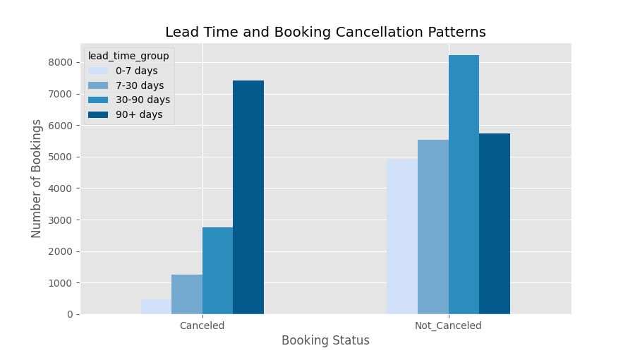
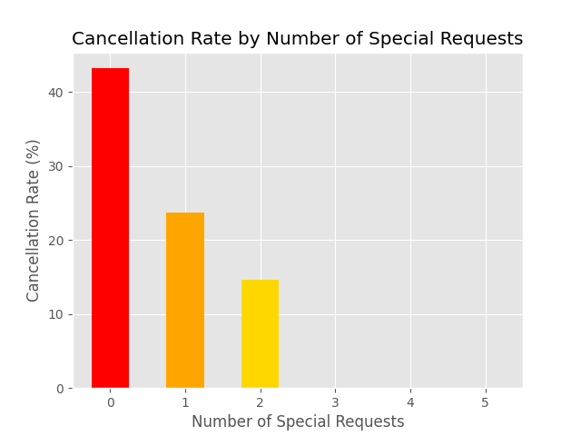
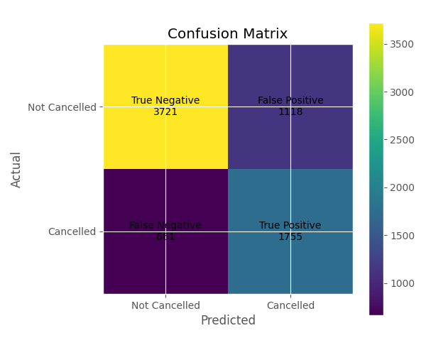

## READ ME

# Hotel Cancellation Analysis

A data analytics project using SQL, Python, exploratory data analysis and logistic regression to identify factors influencing hotel booking cancellations and predict cancellation risk.

## About the project :

This project analyses hotel booking data to identify key factors driving cancellations and builds a predictive model to estimate the likelihood of a booking being cancelled. The goal is to support better revenue management and operational planning.

The analysis uses the Hotel Reservations Classification Dataset, which includes booking details such as lead time, pricing, customer history, and booking status. 

## Business Problem :

Hotel booking cancellations can affect revenue forecasting, room availability planning, and operational decision-making. Understanding cancellation behaviour allows hotels to better anticipate risk and allocate resources effectively.

## Dataset :

* Source: Kaggle Hotel Reservations Classification Dataset ([https://www.kaggle.com/datasets/ahsan81/hotel-reservations-classification-dataset](https://www.kaggle.com/datasets/ahsan81/hotel-reservations-classification-dataset))  
* Target Variable: booking\_status  
* The dataset contains booking details, guest information, room pricing, and booking outcomes.  
* Industry questionnaire responses were also collected to compare model findings with hospitality professionals' experiences. 

## Tools used :

* Python  
* Pandas  
* Matplotlib  
* Scikit-Learn  
* SQLite

##  Repository Structure :

* data/  
* images/  
* docs/  
    
* Hotel\_Cancellations\_Project.py  
* README.md

## Methodology :

* Data Cleaning  
* SQL Analysis  
* Exploratory Data Analysis (EDA)  
* Feature Engineering  
* Logistic Regression Modelling  
* Model Evaluation  
* Industry Insight Comparison

## Key Findings :

* Lead time was the strongest predictor of cancellation.  
* Repeat guests were significantly less likely to cancel.  
* Guests making special requests showed lower cancellation rates.  
* Group size demonstrated a moderate relationship with cancellation behaviour, though the effect was weaker than lead time, repeat guest status, and special requests.  
* Average room price was a weak standalone predictor but contributed to the predictive model.

## Results Summary : 
The project successfully identified several strong predictors of hotel booking cancellations. Lead time emerged as the strongest positive predictor, while repeat guest status and special requests were associated with significantly lower cancellation likelihood. A balanced logistic regression model improved recall from 52% to 73%, reducing missed cancellations by over 500 bookings.

## Model Results:

### Logistic Regression

| Metric | Result |
| :---- | ----- |
| Accuracy | 77.5% |
| Recall | 52% |
| Precision | 73% |

###  Balanced Logistic Regression

| Metric | Result |
| :---- | ----- |
| Accuracy | 75.5% |
| Recall | 73% |
| Precision | 61%  |

The balanced model reduced false negatives from 1171 to 661, improving cancellation detection at the expense of a small reduction in overall accuracy.

## Exploratory Data Analysis Visualisations : 

## Exploratory Data Analysis Visualisations

### Lead Time and Booking Cancellation Patterns

Lead time was identified as the strongest predictor of hotel booking cancellations, with bookings made further in advance demonstrating significantly higher cancellation rates.

### Cancellation Rate by Special Requests

Guests making special requests were significantly less likely to cancel, suggesting greater booking commitment.

### Confusion Matrix

The balanced logistic regression model improved cancellation detection, increasing recall from 52% to 73%.

## Industry Insights :

Preliminary feedback from hospitality professionals broadly aligned with model findings. Respondents identified booking lead time and first-time guests as key contributors to cancellations, which corresponded with logistic regression results showing lead time as the strongest positive predictor and repeat guest status as a negative predictor. Respondents also suggested that changes in travel plans, emergencies, and the availability of cheaper alternatives were common reasons for cancellations, providing possible real-world explanations for the observed relationship between longer lead times and increased cancellation likelihood.

## Future Improvements:

* Collect additional industry questionnaire responses.  
* Explore additional feature engineering techniques.  
* Build an interactive dashboard.  
* Compare with alternative machine learning models.

## Skills Demonstrated : 

*  SQL querying and database analysis  
*  Exploratory Data Analysis (EDA)  
*  Data visualisation with Matplotlib  
*  Feature engineering  
*  Logistic Regression modelling  
*  Model evaluation and refinement  
*  Business-focused interpretation of results

---

